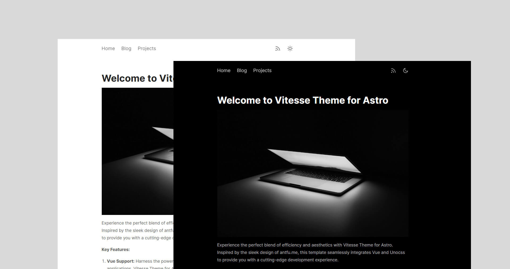

# Vitesse theme for Astro

Vitesse theme for Astro blog, supports Vue and UnoCSS.

[](https://app.netlify.com/sites/kaivanwong/deploys)

## Preview



## Quick Start

[](https://app.netlify.com/start/deploy?repository=https://github.com/kaivanwong/astro-theme-vitesse)

Click this button, it will create a new repo for you that looks exactly like this one, and sets that repo up immediately for deployment on Netlify.

If you  just want to develop locally, you can [create a repo](https://github.com/kaivanwong/astro-theme-vitesse/generate) from this template on GitHub.

## Usage

Just run and visit http://localhost:1977.

```bash
pnpm dev
```

To build the App, you can run:

```bash
pnpm build
```

You will then see the `dist` folder generated for publishing, which you can preview locally with the following command.

```bash
pnpm preview
```

## License

[MIT License](./LICENSE) © 2024-PRESENT [Kaivan Wong](https://github.com/kaivanwong)
